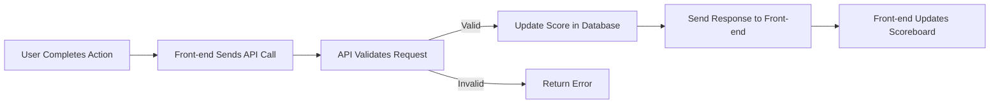
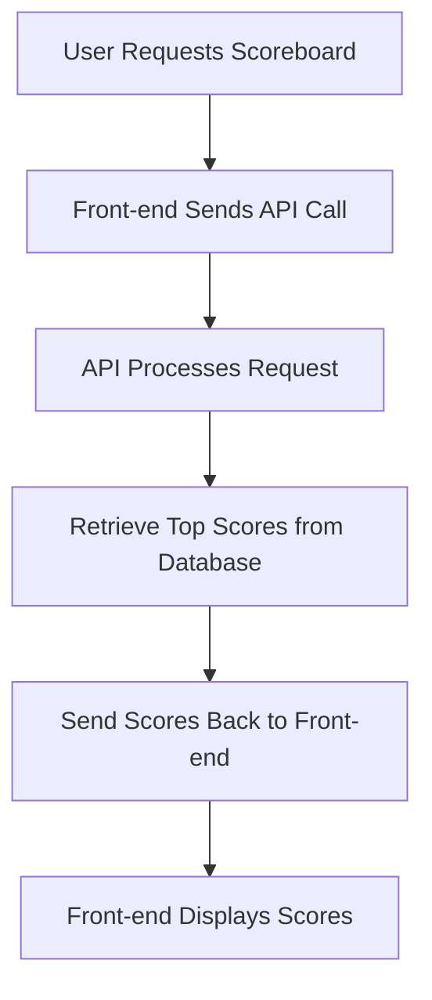

# Scoreboard API Module Specification

## Overview
This document is for the Scoreboard API module. It is used to update user scores when they complete an action. The module will show the top 10 user scores on a website.

## Requirements
1. **Display Scores**: The application must show the top 10 user scores.
2. **Live Updates**: The scoreboard should update in real time when scores change.
3. **User Actions**: Users perform actions that will increase their scores.
4. **API Call**: When a user completes an action, an API call must be made to update their score.
5. **Security**: We need to stop users from changing scores without permission.

## API Endpoints

### 1. Update Score
- **Endpoint**: `POST /api/scores/update`
- **Description**: This updates the score for a user after they complete an action.
- **Request Body**:
    ```json
    {
        "userId": "string", // The user's ID, like "12345"
        "actionId": "string", // The ID of the action, not sure what this is
        "score": 10 // The score to add, could be any number
    }
    ```
- **Responses**:
    - **200 OK**: Score updated successfully.
    - **400 Bad Request**: There is something wrong with the input.
    - **401 Unauthorized**: The user is not allowed.
    - **500 Internal Server Error**: There is a problem with the server.

### 2. Get Top Scores
- **Endpoint**: `GET /api/scores/top`
- **Description**: This gets the top 10 user scores.
- **Responses**:
    - **200 OK**:
    ```json
    [
        {
            "userId": "string",
            "score": 100 // Example score
        },
        // More users...
    ]
    ```

## Execution Flow Diagram



## Score Retrieval Diagram


## Security Measures
- **Authorization**: Each API call needs a token to verify the user.
- **Rate Limiting**: Limit the number of requests to prevent abuse.
- **Input Validation**: Check the input data to stop bad data.

## Additional Comments
- **Documentation Clarity**: It would be better if everything was clearer. Like, what is an action and where it's ID come from
- **Versioning**: It may be good to version the API.
- **Testing**: Testing is important.
- **Logging**: Logging actions can help track problems.

## Conclusion
This document provides a basic specification for the Scoreboard API module. It should help the backend team to implement the necessary features. If there are questions, please ask!

---
